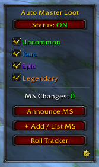
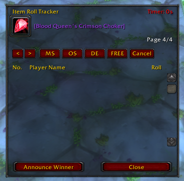
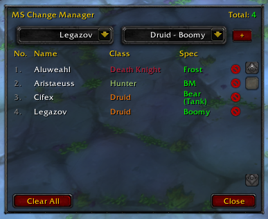
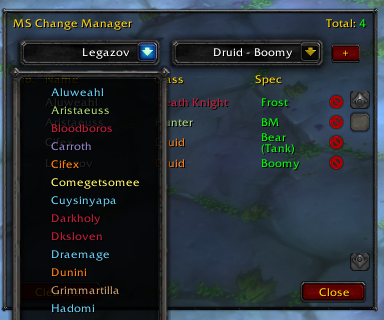
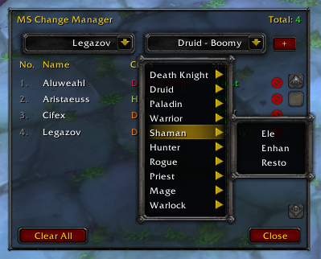

# Auto Master Loot

> A World of Warcraft (3.3.5a) addon designed to streamline raid looting, manage Main Spec (MS) / Off Spec (OS) tracking, and automate item rolling sessions.

---

## Features

* **Automated Roll Tracking:** Easily manage rolls for MS, OS, DE, or FREE items with an integrated countdown timer.
* **MS Change Manager:** Track and update player Main Specs and specializations dynamically from party or raid frames.
* **Class & Spec Colorization:** Fully supports custom class colors (including fixed Death Knight coloring) for clear visual hierarchy.
* **Session History:** Browse through previous roll sessions and past item distributions via page navigation.
* **Custom Filters:** Toggle item quality filters and lock UI or configuration states.

---

## Screenshots

   
   

     
   
      

---

## Installation

1. Download or clone this repository.
2. Extract the folder into your World of Warcraft directory: 
   `World of Warcraft / Interface / AddOns /`
3. Ensure the folder name inside `AddOns` is set to **`AutoMasterLoot`**.
4. Restart your game or reload your UI (`/reload`).

---

## Usage

* Type `/aml` or click the minimap/UI toggle button to open the main configuration panel.
* Drag and drop items into the **Item Roll Tracker** slot to initiate rolling sessions.
* Use the **MS Change Manager** button to record and view player spec modifications before announcing changes to the raid.

---

## License

This project is licensed under the MIT License - see the [LICENSE](LICENSE) file for details.
